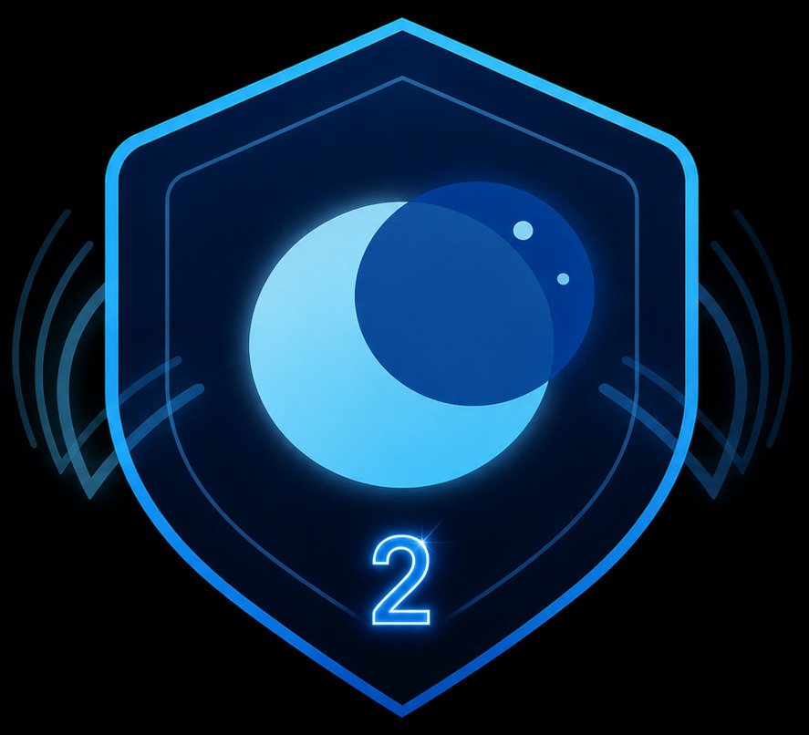

# LunarWing

> Claws are overrated. Grow your wings and fly.

LunarWing is a self-hosted, privacy-focused AI agent runtime and operations platform written in Rust. It connects agents to open communication protocols, extensible WASM tools, and operator-controlled infrastructure.

<p align="center">
  
</p>

## LunarWing v2

The v2 line introduces the new execution engine, a browser-based multi-tenant onboarding console, richer gateway interactions, and a refreshed foundation for skills, memory, workers, and tools.

## Quick links

- [Website](https://lunarwing.org/)
- [Documentation index](docs/README.md)
- [Community guide](COMMUNITY.md)
- [Project manifesto](MANIFESTO.md)
- [Canonical source on Codeberg](https://codeberg.org/LunarWing/LunarWing_v2)
- [IRC: #lunarwing on Libera.Chat](https://web.libera.chat/?channel=#lunarwing)
- [AGPL-3.0-or-later license](LICENSE)

## Why LunarWing

- **Operator controlled** — run the agent, database, providers, workers, and communication bridges on infrastructure you control.
- **Open communication** — prioritize XMPP, IRC through WeeChat, DarkIRC, and other open or self-hostable paths.
- **Extensible by design** — add sandboxed WASM tools and channel adapters without folding every integration into the core daemon.
- **Secret-aware operations** — encrypted secret storage and tenant-scoped operational tooling are built into the deployment model.
- **Production multi-tenancy** — isolate tenants with separate OS users, services, databases, ports, configuration, and optional workers.
- **Reliable automation** — scheduled routines, retry and backoff, health checks, and self-healing tooling support unattended operation.
- **Lunarpunk values** — the core and bundled extensions remain free software under AGPL-3.0-or-later.

## Key v2 capabilities

### Engine V2 and the gateway

Engine V2 provides the channel-neutral execution path used by the v2 gateway, including streaming events, interrupts, stop handling, approval gates, and richer tool-result presentation. New multi-tenant configurations enable Engine V2 by default; direct single-instance configurations must opt in explicitly.

The gateway receives the full interactive experience. XMPP, DarkIRC, and WeeChat can opt in through `ENGINE_V2_CHANNELS`; other channels remain on the legacy path. Opted-in WASM channels currently receive terminal responses and status updates rather than live token edits. Validate channel-specific behavior before enabling Engine V2 for group channels.

Architecture details: [Engine V2](docs/architecture/ENGINE-V2.md).

### Channels and interfaces

- Browser gateway, CLI, and HTTP interfaces
- WASM channels for XMPP, WeeChat, DarkIRC, and Multica
- Optional Gotify notifications and SSH tooling

DarkIRC is opt-in. It is neither rendered nor built for a new tenant unless the operator enables it during tenant creation and builds its supporting service.

### External workers

LunarWing can attach persistent NanoCode, Pebble, or OpenCode worker containers. Worker choice is stored when the tenant is created. Matching `build-tenant --with-*` flags build the shared image; they do not change the worker selected for an existing tenant.

### Model providers

| Provider path | Intended use |
| --- | --- |
| `openai_compatible` | OpenAI-compatible endpoints, including compatible routing gateways |
| `ollama` | Local Ollama deployments |

## Get started with the onboarding GUI

The browser-based onboarding console is the recommended setup path for LunarWing v2. It wraps the multi-tenant administration scripts while showing configuration, command output, validation results, and recovery guidance in one local interface.

Run these commands from the repository root.

### 1. Explore safely in demo mode

```bash
./lunarwing_mt_onboard_web/run.sh --demo
```

Demo mode does not create tenants or modify host services. The launcher still creates its local Python virtual environment, installs the GUI dependencies when needed, and writes local audit logs.

### 2. Prepare the production host

The supported production path assumes Python 3.10 or newer with `venv` and pip, a Linux host using systemd or OpenRC, root or sudo access, Docker or Podman, `jq`, `git`, download access on first launch, and adequate time and disk space for builds.

```bash
sudo ic/scripts/lunarwing-mt-admin.sh doctor
```

The doctor command checks the current host, init system, container runtime, toolchain, and other provisioning dependencies. It does not verify the Python `venv` module.

### 3. Start the real onboarding console

```bash
sudo ./lunarwing_mt_onboard_web/run.sh
```

Open the token-bearing session URL printed by the launcher, normally `http://127.0.0.1:1969/?token=...`. Keep the process running until the workflow finishes, then stop it with `Ctrl+C`.

The GUI supports five operator workflows:

| Workflow | Purpose |
| --- | --- |
| Provision | Create, configure, build, start, and verify a new tenant |
| Secrets | Store or replace one named secret in the encrypted secrets store for a tenant |
| Legacy upgrade | Run preflight and legacy same-host upgrade tooling |
| Kawarimi export | Preview or create a migration bundle; Apply stops the tenant daemon and bridge |
| Kawarimi import | Inspect, stage, and restore a migration bundle on a v2 host |

Full GUI reference: [Browser onboarding console](lunarwing_mt_onboard_web/README.md).

### Review these defaults before provisioning

- The gateway binds to `127.0.0.1` by default.
- New tenants enable Engine V2, SSH support, health checks, build, and start.
- DarkIRC, Gotify, external workers, and optional toolchains remain disabled until selected.
- Leaving the XMPP fields blank does not disable XMPP: the administration script assigns `<tenant>@xmpp.localhost` and provisions the bridge.
- Container-runtime group membership is enabled by default. Membership in the rootful Docker group is effectively root-equivalent; rootless Podman normally uses per-user storage, and a `podman` group may not exist.

### Treat the GUI as a privileged local console

The onboarding server is designed for one trusted operator on loopback. It does not provide user accounts or TLS. Keep `--host 127.0.0.1` and token authentication enabled; do not bind a non-loopback address or use `--no-token`. Use an SSH tunnel for remote administration. Treat the session URL, browser session, generated secrets, and audit directory as credentials. Audit redaction is heuristic and log files follow the process umask, so choose a protected `--log-dir` and handle logs as sensitive data.

## Advanced setup paths

### Interactive Python CLI

The terminal onboarding client remains available for provisioning, secrets, exports, and legacy upgrade operations. It does not provide the guided Kawarimi import flow available in the GUI.

```bash
python3 -m venv .venv-mt-onboard
./.venv-mt-onboard/bin/python -m pip install rich questionary
sudo ./.venv-mt-onboard/bin/python -m lunarwing_mt_onboard
```

See the [Python onboarding CLI reference](lunarwing_mt_onboard/README.md) for resume files and non-interactive use.

### Direct multi-tenant administration

`ic/scripts/lunarwing-mt-admin.sh` remains the source of truth for operators who need exact flag-level control.

```bash
sudo ic/scripts/lunarwing-mt-admin.sh doctor
sudo ic/scripts/lunarwing-mt-admin.sh add-tenant ruffles --with-opencode
sudo ic/scripts/lunarwing-mt-admin.sh build-tenant ruffles --with-wasm --with-opencode
sudo ic/scripts/lunarwing-mt-admin.sh start-tenant ruffles
sudo ic/scripts/lunarwing-mt-admin.sh status ruffles
```

The production scripts support rootless per-user Podman or a configured rootful Docker deployment, with systemd or OpenRC service management. Choose a worker on `add-tenant`, repeat its flag on `build-tenant` to build the image, and let `start-tenant` launch the stored selection. For DarkIRC, use `--enable-darkirc` when adding the tenant, then run `sudo ic/scripts/lunarwing-mt-admin.sh build-darkirc --tenant ruffles` before starting it.

- [Multi-tenant quickstart](docs/guides/MT-ADMIN-QUICKSTART.md)
- [Production operations reference](docs/ops/MULTITENANCY-PRODUCTION.md)

## Upgrades and migration

The GUI legacy-upgrade workflow wraps the PostgreSQL and rootful-Docker v1
upgrader. It runs preflight and dry-run by default, accepts supported three-part
v1 target tags, and is not a supported v1-to-v2 upgrade path.

For a v1 tenant moving to v2, prepare a separate v2 deployment and rehearse a staged Kawarimi export/import. Validate the restored tenant before cutover. Before selecting Start, the operator must stop the old tenant daemon and bridge when both tenants use the same XMPP identity; the GUI does not enforce this gate.

GUI import defaults to `apply=false` and `start=false`: it validates the real bundle and prints a dry-run plan. Apply restores and stages the tenant; Start is a separate opt-in. These safe defaults are GUI-specific—the direct import script mutates the host unless `--dry-run` is passed explicitly.

Kawarimi supports PostgreSQL tenants; libSQL bundles are refused. A real export stops tenant writers and produces a sensitive root-owned `0600` bundle containing the master key and XMPP credentials. Import creates fresh host-local gateway and webhook tokens, so clients must authenticate again. Back up first, review the plan, protect bundles in transit, and delete them after the restored tenant is verified.

- [Machine migration runbook](docs/ops/MT-MACHINE-MIGRATION.md)
- [Legacy upgrade notes](docs/ops/MT-LEGACY-UPGRADE-NOTES.md)

## Development and testing

The Rust workspace lives under `ic/` and uses Rust 1.96.

```bash
cd ic
cargo fmt --all -- --check
cargo test --locked --features "libsql integration"
```

Additional test surfaces:

- [Rust and browser E2E tests](ic/tests/e2e/README.md)
- [External worker harness](tests/README.md)
- [Testing guide](docs/guides/TESTING_GUIDE.md)
- [XMPP integration harness](ic/testing/lunarwing-xmpp/README.md)

## Documentation

| Area | Reference |
| --- | --- |
| Documentation index | [docs/README.md](docs/README.md) |
| Architecture | [docs/architecture/](docs/architecture/) |
| Operator guides | [docs/guides/](docs/guides/) |
| Production operations | [docs/ops/](docs/ops/) |
| Known bugs and status | [docs/bugs/README.md](docs/bugs/README.md) |

## Project and community

LunarWing focuses on user freedom, self-hostable infrastructure, and open communication protocols. Read the [manifesto](MANIFESTO.md) for the project philosophy and the [community guide](COMMUNITY.md) for participation details.

[](https://web.libera.chat/?channel=#lunarwing)

- [Project blog](https://blog.lunarwing.org/)
- [Codeberg development repository](https://codeberg.org/LunarWing/LunarWing_v2)
- [GitHub convenience mirror](https://github.com/LunarWingOrg/lunarwing2) — the mirror may lag behind Codeberg

LunarWing is self-funded and maintained by volunteers. The project is licensed under [AGPL-3.0-or-later](LICENSE).
